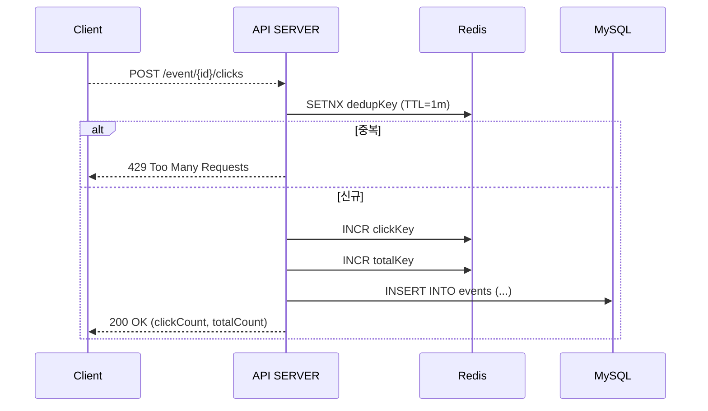

## 이벤트 동시성 제어를 위한 PoC 프로젝트

### 요구사항 정리
- 유저가 이벤트 클릭시 Count 가 증가해야함 단, 중복으로 Count 가 되서는 안됨
  - 구현 방법 1. Count 컬럼에 +1 씩 더한다.
  - 구현 방법 2. row 별로 insert 후 Count() 적용한다.

- 실시간으로 변화하는 유저 Count 를 유저 화면에 노출 
  - 1 Count 된 숫자를 캐싱 하거나
  - 2 매번그냥 조회해서 땡겨오거나

다이어 그램으로 구성해보기
