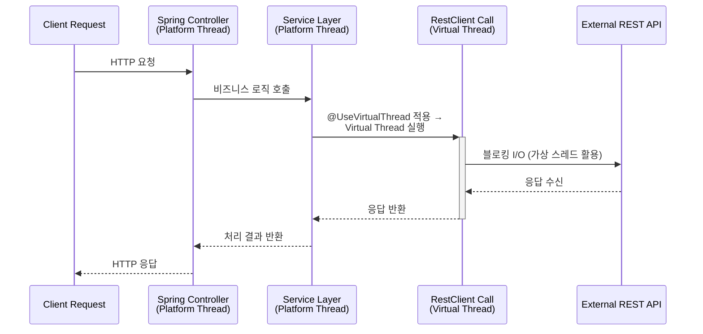

# Virtual Thread 적용 관련 어노테이션

> Spring Boot 애플리케이션에서 Virtual Thread를 쉽게 활용할 수 있는 어노테이션을 설계 및 제공합니다
> 전체 Thread 를 Virtual Thread 로 변경하는 것이 아닌 점진적으로 전환 할 수 있는 기능을 제공할 수 있게 하였습니다.

### 개발환경
- Java 21 (Virtual Thread API 지원 필요)
- Spring Boot 3.5.4
- RestClient
- Gradle

### 기능
- Virtual Thread 실행: @UseVirtualThread 애너테이션을 통해 선택적으로 Virtual Thread에서 실행
- ~~MDC 전파: Virtual Thread로 실행되는 메서드에서도 MDC 컨텍스트를 자동으로 전파~~ (TODO)

### 사용 예시

```java
@Service
public class ExampleClient {
  private final RestClient restClient;
  public ExampleClient(RestClient restClient) { this.restClient = restClient; }

  @UseVirtualThread
  public Map<String, Object> getUser(String url) {
    return restClient.get()
        .uri(url)
        .retrieve()
        .body(new ParameterizedTypeReference<>() {});
  }
}
```
- 애너테이션 미사용 시 기존 플랫폼 스레드에서 실행됩니다.
- spring.threads.virtual.enabled=true 설정 시 MVC 컨트롤러 요청도 Virtual Thread에서 실행됩니다.

```java
var result = VtStructured.structured(
    () -> partnerClient.getUser(url1),
    () -> partnerClient.getUser(url2),
    (user1, user2) -> combine(user1, user2)
);
```
- 두 개의 호출을 병렬 실행하고 하나라도 실패하면 전체 작업을 취소합니다.

### 팁

- fan-out 서비스는 max-concurrent-forks 설정을 통해 동시 실행 제한을 두는 것이 좋습니다.
- 타임아웃 및 재시도 정책을 설정하여 다운스트림 장애 전파를 최소화하세요.
- 테스트 환경에서 Virtual Thread 여부를 Thread.currentThread().isVirtual()로 쉽게 확인할 수 있습니다.


### RestClient 구간에만 적용 시 장점
1. 효율적인 스레드 사용 
   - 외부 HTTP 호출은 대부분 블로킹 I/O
   - 플랫폼 스레드 모델에서는 RestTemplate, WebClient(blocking), HttpClient 호출 시 스레드가 대기
   - 가상 스레드 적용 시, 블로킹 동안 캐리어 스레드 반환 → 다른 작업 수행 가능
2. 점진적 도입 가능
   - 전체 코드를 가상 스레드로 전환하지 않고,
   - 리스크 낮은 I/O 구간(예: REST 호출)만 먼저 적용
   - 모니터링하면서 스레드 수 감소와 TPS 개선 여부 확인 가능
3. Thread Pinning 위험 최소화(JDK 24에서 해소, Spring Camp 2025 발표 참조)
   - 대부분의 RestClient 호출 코드는 synchronized 블록 안이 아님
     - **Java 21+** 에서는 HTTP I/O는 이미 가상 스레드 친화적(SocketChannel + EPoll 기반)  
     → Thread Pinning 거의 없음
     
```java
@Configuration
public class VirtualThreadConfig {
    @Bean(destroyMethod = "close")
    public ExecutorService virtualThreadExecutor() {
        return Executors.newThreadPerTaskExecutor(
                Thread.ofVirtual().name("vt-thread-", 0).factory()
        );
    }
}
```

```kotlin
@Configuration
class VirtualThreadConfig {
    @Bean
    fun applicationTaskExecutor(): AsyncTaskExecutor =
        TaskExecutorAdapter(Executors.newVirtualThreadPerTaskExecutor())
}
```

### 적용 흐름도

- `Controller`, `Service`는 기존 플랫폼 스레드에서 실행됩니다.
- RestClient 호출 구간만 Virtual Thread로 실행되어, 블로킹 I/O 시에도 스레드 낭비 없이 처리됩니다.
- 이를 통해 점진적 전환과 스레드 자원 최적화를 달성합니다.
